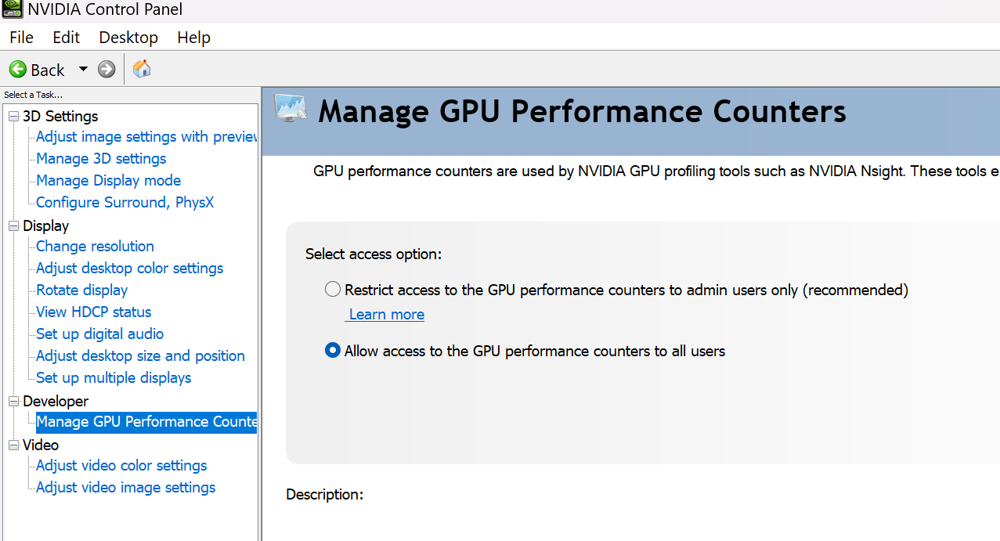

# All about cuda

## c++ summary succint
statically typed
compiled language
low-level memory manip
high-level abatraction: class, interface
oop, 
generic
versatile

## dev workflow
1. code design and structuring: code part benifit from paralle, data deps, data races
2. host and device code separation: execucation flow
3. kernel configuration: num threads per block and number of blocks per grid
4. memory management: host and device memory and transfer back-forth
5. kernel launch: async, hence need sync primitives
6. debugging and profiling

### GPU Arch

thread hieracrchy

warp/block scheduling: block is on 1 SM, which is deviced by warp size

CUDA core: SP (streaming processor): arithmatic/logic ops

SM (streaming multi-processors): multiple sp, warp(SIMD) schedulers, special-function units and load/store units (memory)

host
device

each thread block run on a single SM (streaming multiprocessors), shared memory and synch

Thrust does all CUDA API calls for you. So while you can use Thrust algorithms on manually allocated memory or pass the memory from a thrust::device_vector to a kernel, you don't need cudaMalloc and cudaMemcpy,

## Memory

### Global memory (non-cachable, large datasets)
coalesced memory access: same as cpu-programming
warp access contiguous memory locations

### Readonly constant memory cachable
  Total constant memory (Kbytes) 64.0

### Readonly texture memroy cachable
2d access, interpolation addressmodes

### Memory Program persp
cudaMalloc, cudafree, cudaMemcpy all could be hidden using Thrust lib

### Memory performance
global: off-chip
shared memroy: on chip
local memory: off chip
constant memory: cache access
texture meory: cache readonly, 

## warp: 32 threads exec simultanesuly by sm

### performance issue: warp divergence

## Unified Memory

accessible both by cpu and gpu

## with threadblock, shared memroy

### static shared memroy
    // static shared memory allocation ex: __shared__ float partialsum[256];
### dynamic shared memroy
    // dynamic shared memory allocation, size is provided at 3rd param in the kernal launch

### sync shared memory within block
        __syncthreads();

## Thrust::universal

## Synchronization primitive
cpu-gpu device sync 

## performance

### Goal
Higher occupancy: higher ratio of active warps / max number of warps

### What can affect concurrency (resource constraints)

number of register per thread,
shared memroy per block
max number of threads per block

1. register and shared memory not available
  Max Registers per block 65536.0
  Max Registers per SM 65536.0

  Max Threads per block 1024.0
  Max Threads per SM 1536.0
  SM count: 76

## debugging

### vs code

nsight vs code plugin

      {
        "name": "CUDA C++: 0_vector_add",
        "type": "cuda-gdb",
        "request": "launch",
        "console": "integratedTerminal",
        "cwd": "${workspaceFolder}/build/bin",
        "program": "${workspaceFolder}/build/bin/cuda/0_vector_add/0_vector_add"
      },

## profiling 

### Nsight Systems: 

### Nsight Compute: profile CUDA kernels

metrics: effective compute utilization, effective memory bandwidth utilization
cli: ncu

run into error: 

==ERROR== ERR_NVGPUCTRPERM - The user does not have permission to access NVIDIA GPU Performance Counters on the target device 0. For instructions on enabling permissions and to get more information see https://developer.nvidia.com/ERR_NVGPUCTRPERM

solution: 

Download the Nsight Compute on your Windows host to "visualize the reports generated by the CLI."

ncu -o ./profiling/matmul matmul
ncu -o ./profiling/0_vector_add  ./0_vector_add 

## tools and profiler
cuda-gdb
nvprof: replaced, legacy
nsight systems

nvprof: This is an older profiler that doesn’t work with GPUs/devices with compute capability 8.0 and higher. This was replaced by nsys and ncu.
Nvidia Visual Profiler/NVVP: Replaced by Nsight Systems/Nsight Compute

## Libs

cuBLAS: dense linear algebra
cuFFT: 
cuRand: random numbers, simulations, monte carlo
Thrust: 
cuDNN
